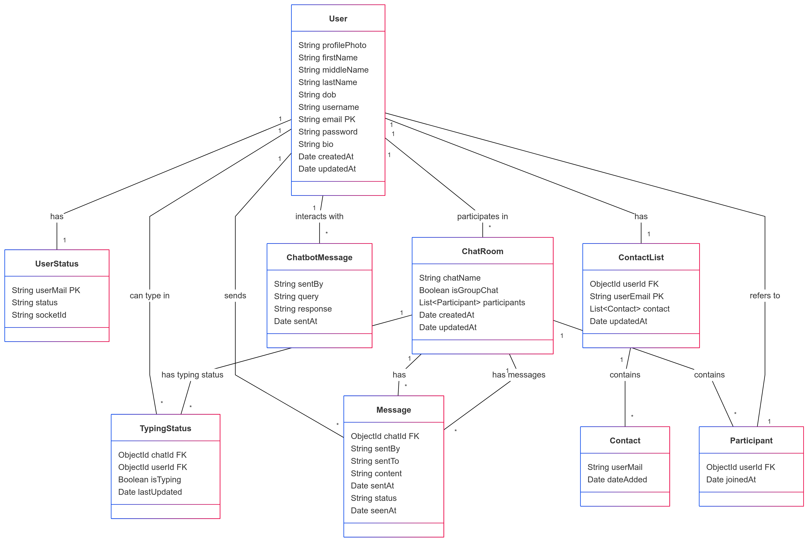

# NexTalk

## Description
This project is designed to provide a web-based platform for chatting and connecting people together. It allows users to chat with their friends. The platform offers a clean and user-friendly interface, making it accessible and easy to use.

## Tech Stack

- **Frontend**: 
  - ReactJS: For building the user interface.
  - Axios: For making HTTP requests.

- **Backend**:
  - Node.js: For handling server-side operations.
  - Express.js: For creating RESTful APIs and routing.
  - JWT (JSON Web Token): For authentication and authorization.
  - Socket.io: For real time chatting.

- **Database**: 
  - MongoDB: A NoSQL database for storing data in a flexible, schema-less manner.
  - Mongoose: An ODM (Object Data Modeling) library to work with MongoDB.


## Database Models

### **User Model**
```md
User model stores essential user details such as profile information, authentication credentials, and timestamps.
- `profilePhoto`: Stores a Base64 string of the user's profile picture.
- `firstName`, `middleName`, `lastName`, `dob`: User's personal details.
- `username`, `email`, `password`: Authentication-related fields.
- `bio`: Defaulted to "Hey there!!".
- `createdAt`, `updatedAt`: Timestamps for user creation and updates.
```

### **Chat Room Model**
```md
Defines chat rooms and their participants.
- `chatName`: Optional name for the chat room.
- `isGroupChat`: Determines if the chat room is a group chat.
- `participants`: Array of users with references to `User` model.
- `createdAt`, `updatedAt`: Track timestamps.
```

### **Message Model**
```md
Stores messages sent between users.
- `chatId`: References `ChatRoom` model.
- `sentBy`, `sentTo`: Users involved in the conversation.
- `content`: The actual message text.
- `sentAt`, `status`, `seenAt`: Tracks message delivery and read status.
```

### **Chatbot Message Model**
```md
Handles chatbot interactions.
- `sentBy`: User who sent the query.
- `query`: The user's query.
- `response`: The chatbot's response.
- `sentAt`: Timestamp of the interaction.
```

### **Contact List Model**
```md
Manages user contact lists.
- `userId`: References `User` model.
- `userEmail`: Email ID of the user.
- `contact`: Stores a list of contacts and timestamps of additions.
```

### **Typing Status Model**
```md
Tracks user typing status.
- `chatId`: References `ChatRoom` model.
- `userId`: References `User` model.
- `isTyping`: Boolean flag indicating if the user is typing.
- `lastUpdated`: Timestamp for last status update.
```

### **User Status Model**
```md
Stores online/offline status of users.
- `userMail`: Email of the user.
- `status`: Online/offline status.
- `socketId`: Tracks socket connection.
```

## Model Relationships
- `User` model connects to `ChatRoom`, `Message`, `ContactList`, and `UserStatus`.
- `ChatRoom` holds multiple `User` references as participants.
- `Message` model references `ChatRoom` and tracks sent/received messages.
- `TypingStatus` references both `User` and `ChatRoom`, indicating live typing status.
- `ChatbotMessage` stores user queries and chatbot responses separately.
- `ContactList` allows users to maintain a list of friends by referencing other `User` models.

These models work together to provide a seamless chat experience with authentication, real-time messaging, chatbot interactions, and user status tracking.




## Routing
The application has the following routes:

### **Authentication Routes** (`/auth/`)
```md
POST /auth/signup - Register a new user.
POST /auth/login - Log in an existing user.
POST /auth/status - Update the user's status.
POST /auth/logout - Log out the user and set status offline.
```

### **User Profile Routes** (`/home/profile/`)
```md
GET /home/profile/search-profile - Search for a user profile.
POST /home/profile/add-contact - Add a user to the contact list.
POST /home/profile/change-username - Change the username of a user.
POST /home/profile/get-profile - Retrieve a user’s profile details.
POST /home/profile/update-picture - Update a user’s profile picture.
PATCH /home/profile/profile - Update profile details.
DELETE /home/profile/profile - Delete a user profile.
```

### **Chat Routes** (`/home/chat/`)
```md
POST /home/chat/contactlist - Retrieve all contacts.
POST /home/chat/create-chat-room - Create a new chat room.
POST /home/chat/get-chat-list - Get a list of chat rooms.
POST /home/chat/get-chat-id - Retrieve a chat room by ID.
POST /home/chat/send-message - Send a message in a chat room.
GET /home/chat/get-messages - Get chat history.
POST /home/chat/chatbot-query - Send a message to the chatbot.
POST /home/chat/retrieve-chat-bot-history - Retrieve chatbot message history.
```

## Features

This platform includes several key features:

### **User Authentication**
```md
- Users can sign up, log in, and access their profile.
- Authentication is managed via JWT tokens for secure access.
```

### **Real Time Chatting**
```md
- Users can send and receive messages in real time.
- Support for private and group chats.
- Messages are stored with timestamps for conversation tracking.
```

### **Contact List**
```md
- Users can add and manage their contacts.
- View the online/offline status of contacts.
- Search and filter contacts easily.
```

### **Profile Management**
```md
- Users can update their profile information, including profile pictures and bios.
- Admins can manage and update user accounts.
```

### **ChatBot**
```md
- Users can interact with an AI chatbot for automated responses.
- Chatbot assists with common queries and predefined commands.
```

### **Themes (Under Development)**
```md
- Users will be able to choose from different themes for customization.
```

### **Group Chat (Under Development)**
```md
- Users will be able to create and manage group chats.
- Support for multiple participants in a single chat room.
```

### **Real Time Notifications (Under Development)**
```md
- Users will receive real-time notifications for new messages and status updates.
- Notifications for friend requests and important alerts.
```

### **User Management (Under Development)**
```md
- Users will be able to block, unblock, and remove contacts.
- Manage active chat users and restrict unwanted interactions.
- View and control chat accessibility and privacy settings.
```

